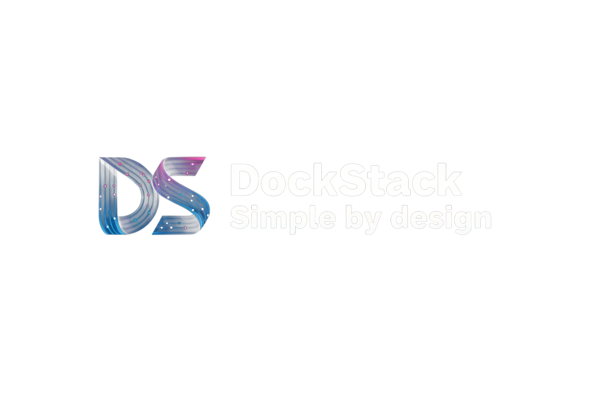
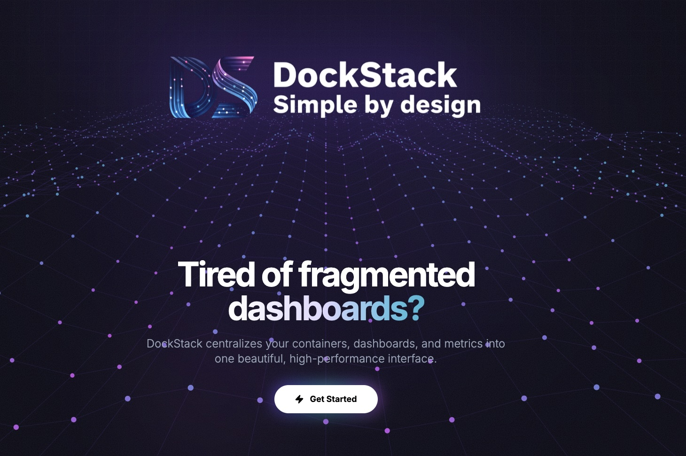
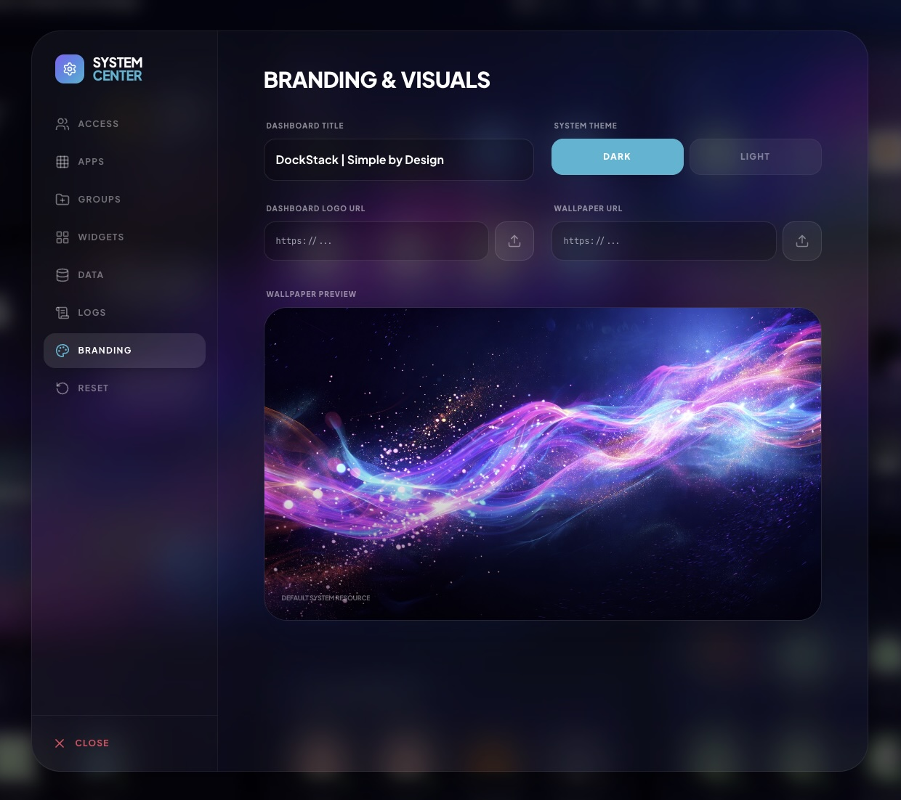
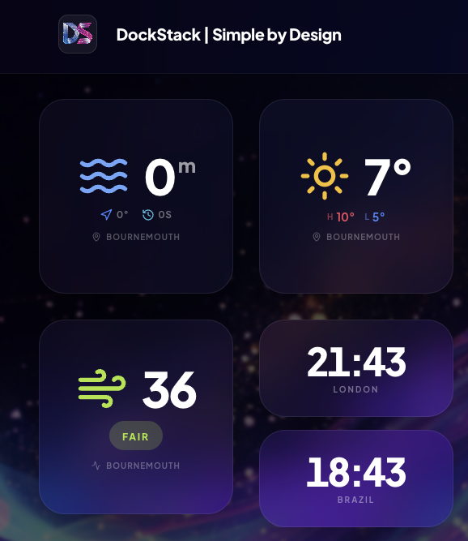
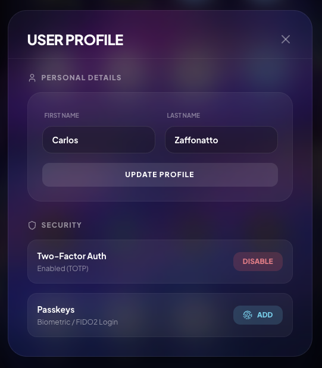
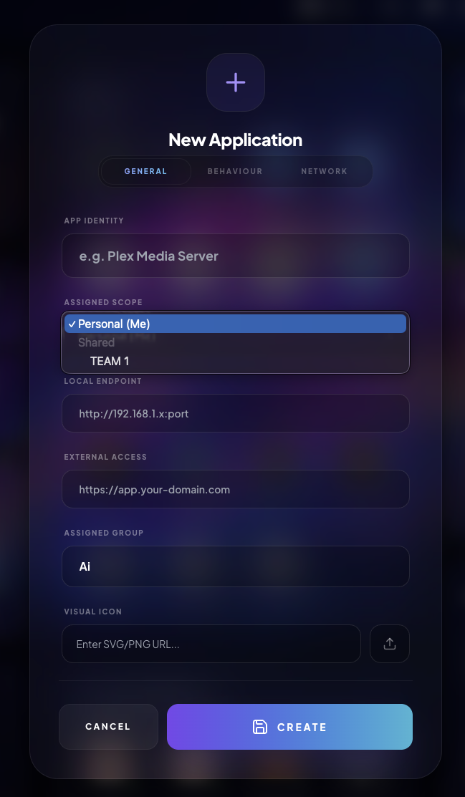
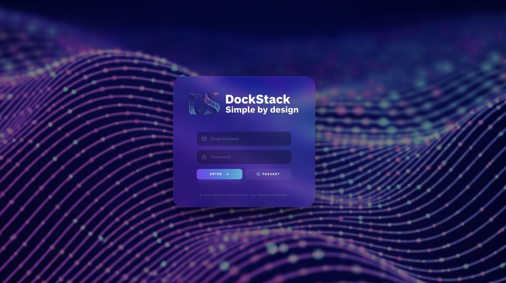

<div align="center">



<br />

[](https://opensource.org/licenses/MIT)
[]()
[]()
[](https://nodejs.org/)
[](https://tailwindcss.com/)

<br />


<br />

<p align="center">
  <b>DockStack</b> is a high-performance, single-node dashboard engineered for apps centralization. <br />
  It utilizes a radical <b>Zero-Build React Architecture</b>—running React 19 natively in the browser <br /> 
  via ES Modules and a dynamic server-side transpiler.
</p>

<a href="https://www.dockstack.uk">
  
</a>

<br /><br />

</div>

---

## 📸 Screenshots

| **Dashboard View** | **System Center** |
|:---:|:---:|
|  |  |
| **Smart Widgets** | **User Profile** |
|  |  |
| **App Management** | **Secure Login** |
|  |  |

---

## ⚡ The "No-Build" Revolution
DockStack eliminates the friction of modern web development. There is **no Vite, no Webpack, and no build step**.
- **Dynamic Transpilation:** `server.js` uses `esbuild` to transform `.tsx` and `.ts` files on-the-fly at request time.
- **Native ESM:** The frontend is powered by a high-performance Import Map, loading dependencies directly from optimized CDNs.
- **SQLite Persistence:** All configuration is stored in a robust SQLite database (WAL Mode), enabling instant saves without file-system lag.

---

## ✨ Features
*   **🧩 Modular DnD Grid:** A fluid 3-column layout engine supporting drag-and-drop reorganization of apps and widgets.
*   **🛠️ System Center:** A powerful tabbed administrative interface for User CRUD, Team management, and Branding.
*   **🔐 Next-Gen Security:** Native support for **Passkeys (WebAuthn)**, JWT session management, and TOTP (MFA).
*   **🌓 Adaptive Glassmorphism:** Stunning "Cyber Dark" and "Cloud Light" themes with real-time CSS variable injection.
*   **📡 Smart Widgets:** Async weather, air quality, marine, and world clock modules powered by Open-Meteo.

---

## 🛠️ Tech Stack
| Component | Technology |
| :--- | :--- |
| **Runtime** | Node.js (Express) |
| **Database** | SQLite (Better-SQLite3) |
| **Transpiler** | Esbuild (Dynamic transformed ESM) |
| **Frontend** | React 19 (Zero-Build) |
| **Icons** | Lucide-React |
| **Styling** | Tailwind CSS (JIT via CDN) |

---


## 📂 Architecture
DockStack follows a clean, monolithic structure designed for portability:

```text
.
├── server.js          # Express server & Dynamic TSX Transpiler
├── index.tsx          # React Entry point
├── App.tsx            # State & Persistence Orchestration
├── types.ts           # Unified TypeScript Interfaces
├── dockstack.db       # Portable SQLite Database
├── components/        # Modular UI Components (Dashboard, Cards, Modals)
├── contexts/          # State Providers (Auth, Themes)
```

---

## 📊 Database Schema Summary
| Table | Purpose |
| :--- | :--- |
| `users` | Identity, Roles, and MFA Secrets |
| `authenticators` | WebAuthn/Passkey Public Keys |
| `services` | Application metadata and endpoints |
| `categories` | Grouping containers for services |
| `widgets` | Async data module configurations |
| `meta` | Global branding, themes, and assets |

---

## 🎨 Icon Pack
DockStack pre-loaded with a local library of high-quality service icons to get you started immediately.
* **Offline Ready:** All icons are served locally from `icons/png/`—no external dependencies or tracking.
* **Broad Support:** Includes optimized assets for popular self-hosted services (e.g., 1Password, 2FAuth, 3CX).

---

## 🗺️ Roadmap
- [x] **v5.0.0:** Administrative interface for User CRUD, Team management, and Branding, MFA/Passkey (WebAuthn) Support.
- [ ] **v5.0.1:** Icon Pack.
- [ ] **v5.2.0:** OIDC / OAuth2 Provider Integration.
- [ ] **v5.3.0:** Docker Image (Official Hub).

---

<div align="center">
  <sub>Built for the homelab community. Simple by design.</sub>
</div>
